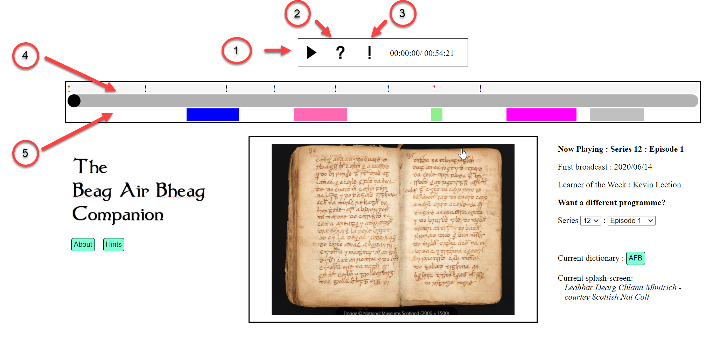

# The Beag air Bheag Companion

Beag air Bheag is a long-running BBC radio programme specifically designed to help students of Scottish Gàidhlig develop their language skills. Much of the material for programme episodes is available from BBC web-pages as downloadable podcasts and viewable text transcripts. The Companion provides a way of "curating" this material to make access more convenient and also to provide serious students with a way of adding their own notes. It runs locally in a web-browser such as Chrome or Firefox and presents all of the material for a selected programme episode in a compact, accessible form. Here's a sample page:

## Principal elements

Significant Elements of the Companion page for a typical episode are as follows:

1. Yes, you guessed it, a toggled start/top button to plays the audio for the selected episode. You can advance or return the play-position by clicking on the" sound-bar", dragging the "play-head" with the mouse or by using the scroll-wheel.
2. Something new  - the Replay button, specially designed for students struggling with comprehension of a troublesome word or phrase. The "replay" button rewinds the audio at the current position by 5 seconds and then replays it. You can use this repeatedly while you work out what is being said.
3. Something else new - the "Shriek" button. Having decoded a section, you might want to create a note to remind yourself of your interpretation when returning at some future point. The note would typically be something brief like "'jay hoorsht ay' - dè thuirt e - what did he say?". You enter the note text into a "note-entry form  that replaces the "splash-screen" in the "activity panel" in the centre of the display.
4. The "noteline"- when you create a note, as above, an exclamation mark will appear above the "sound-bar" at the corresponding point in the podcast. The note is now permanently filed in the Companion's data store and will appear on the soundbar whenever you return to the epside. If you mouse over a note mark, you will see the text that you entered and if you click on it, the corresponding 5-second sound-byte will play. Troublesome sections which have not yet been resolved can be filed as "queries" rather than notes and display as red "question mark" symbols rather than black exclamation marks. This makes it easy to pick out outstanding issues so that you can keep coming back to them. The penny usually drops eventually.
5. The "texts" line - this indicates the presence of transcripts for sections of a podcast. The coloured texts panels are positioned in the context of the soundbar - ie their start and end position correspond with the associated audio. Mousing over a panel will show what it contains. Clicking on a panel will display its content in the activity panel. Double-clicking on a word in a transcript will launch a translation of the selected word in the current Gàidhlig on-line dictionary (both Am Faclair Beag and the BBC dictionary are supported)

## The "Fugitives"

Other features of the system are hidden in "fugitive buttons" that appear as icons to the left and right of the main sound-control buttons.They are revealed by mousing-over these areas of the screen. They're implemented in this way because they will be used relatively infrquently and it was felt that they shouldn't be allowed to over-crowd the display. The most important of these fugitive functions are:

1. A "Search" button that allows you to search for texts and notes for a particular text string.
2. A "Jotter" button that opens a simple text editor to maintain a record of useful words and phrases. You could just use Windows Notepad or similar, of course, but experience shows that it's very handy to have this facility within the body of the application.
3. a "Translate" button that opens Google's Gàidhlig translator. Use cut and paste to blast troublesome transcript sections straight into Google for explication.
4. Backup and Restore buttons that allow you to create local backup files for your notes and jotter - see "Architecture and Limitations", below. Backup files will appeear as (versioned) instances of a babbackup.txt file in your download folder.

## Architecture and Limitations

The Companion is best described as a "lightweight" study tool in the sense that there is no central database providing high-quality, secure storage for your locally-generated data.  In the Companion, your notes and jotter are held in browser storage - the same place essentially that your browser uses to maintain its page history etc. As such it is subject to "prejudicial" events. As far as is known, the only way to lose your notes from the Companion would be to re-install your browser - just deleting your page history, for example, wouldn't cause a problem - but these are murky waters and so development of the backup button has been a high priority. Use it regularly - one click and you're done. There's no technical reason why the Companion could **not** have used a central database, but doing so would have greatly increased the requirmenet for system-support, and since the Companion is an open-source, non-commercial operation, support is in short supply. 

An advantage of the design is that because private data is held locally, there is no pressing need for a "signon" system to burden the user with yet another password. A disadvantage is that since the technology used to store locally-generated data in the browser involves the use of async functions, the Companion cannot be used in Internet Explorer.

Another unusual feature of the the Companion is that it runs as a local html file - ie it is launched  by clicking on a file stored on your own machine rather than by referencing a url on a remote server. This is because local operation is the only way of accessing a local audio file. In principle, of course, audio files for BBC podcasts could have been served from a central server and much anguish thus avoided. But this would clearly have represented a serious copyright violation. There **is** in fact a central database, but this holds only "metadata" such as programme run-times and titles. The transcript texts displayed by the system are "scraped" from BBC website pages by referencing the centrals database's knowledge of the source page locations. On first access you will see this taking place in real-time while the system displays a "loading" place-holder. Once retrieved, transcript texts are tucked away in brower storage so that subsequent reference is instantaneous.

## Installation

Installation for casual use is extremely simple and is described on the download page at https://ngatesystems.com/beagairbheag/index.html. Developers are welcome to inspect the code in this repository and to take cloned copies as they see fit. No instructions are provided for replicating the public system currently installed at ngatesystems.com/beagairbheag, but all the necessary constituents are available within the repository and as a developer you'll surely know how to use these.

## Contact

Use the Git Issues tab to raise programming issues. For general comments, an email to info@ngatesystems.com should produce a response.